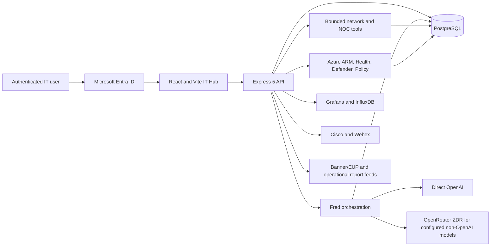

# SCCC IT Insights Hub

SCCC IT Insights Hub is the authenticated operations, reporting, infrastructure
inventory, and institutional-knowledge application for the Seward County
Community College IT department. It brings day-to-day work, incidents, network
evidence, cloud inventory, operational procedures, training, and the Fred AI
assistant into one internal system.

The Hub is designed for continuity of operations. Its purpose is to reduce the
amount of critical environment knowledge that exists only in one person's head,
shorten troubleshooting time, preserve evidence and decisions, and make current
operational state understandable to both specialists and staff who are still
learning the environment.

This repository contains the IT Insights Hub. It does not contain every SCCC
application described in the broader unified-platform architecture.

## Who the application is for

The application is restricted to authenticated SCCC IT personnel. Microsoft
Entra ID supplies identity, name, email, job title, and role information. The
application applies its own authorization rules after authentication.

Typical roles include:

- **CIO** — department-wide reporting, architecture generation, projects,
  strategic objectives, analytics, user administration, and guarded overrides.
- **Network and network engineer** — shared operational data plus authorized
  network inventory and diagnostic functions.
- **Help desk, security, and staff** — personal work, shared operational records,
  infrastructure visibility, guided diagnostics, training, and Fred.

An emergency break-glass account can be configured for an Entra outage. Local
password authentication is removed from ordinary accounts and must not be used
as a parallel sign-in path.

## What the Hub does

### Personal work and departmental reporting

- Provides each staff member with a home page, task list, and weekly work log.
- Records accomplishments, follow-up work, status, dates, notes, and ownership.
- Lets authorized staff delegate work to another active team member with
  attribution to the assigning person.
- Rolls individual work into department weekly reporting.
- Shows the authenticated team a shared Zendesk resolved-ticket scorecard limited
  to Tracy, Mark, Maria, Lucas, Illia, and Craig, including zero-count rows.
- Applies that same current-team roster to weekly submission status. Retired and
  former staff remain in historical attribution but do not appear as current
  participants.
- Tracks risks, issues, projects, goals, incidents, and post-incident reviews.
- Maintains a Process Library for reusable operational runbooks.
- Measures authenticated product usage such as sessions, pages visited, active
  time, and Fred messages rather than treating assignment alone as engagement.

### Incident and operational continuity

- Provides shared incident rooms for outage coordination.
- Preserves incident messages, decisions, owners, and resolution state.
- Captures after-action reviews and lessons learned.
- Connects recurring resolutions to concise runbooks using Symptoms, Checks,
  Fix, Validation, and Rollback.
- Keeps operational history available when a vendor service, individual
  engineer, or primary SaaS system is unavailable.

### Network inventory and evidence

- Maintains switch and VLAN inventory, including hostname, management address,
  model, building, location, status, subnet, gateway, type, and notes.
- Groups switches, VLANs, phones, links, and related evidence by building.
- Uses the clickable campus map as the primary support entry point, followed
  immediately by health-sorted building cards. Each building detail includes a
  building-scoped physical Port Map; the campus-wide Port Map remains available
  as the unfiltered engineering view.
- Presents a campus map, topology map, node details, reciprocal links, and a
  physical Port Map with interface descriptions and learned relationships.
- Uses current monitoring and topology evidence to distinguish a physical
  switch from an SVI, endpoint, stale alias, or other monitored object.
- Correlates link state, LLDP neighbors, port details, phones, building health,
  and multiple probe vantage points when the configured integrations are
  available.
- Stores redacted device-configuration backups for comparison and recovery
  guidance. Authorized network users can use the protected download path for
  the original file when operational recovery requires it.
- Records switch and VLAN changes in an audit trail with actor, timestamp,
  source, action, and field-level before/after values. Authorized updates can be
  rolled back, and the rollback creates another audit record.
- Supports maintenance notes and exportable switch/VLAN maintenance history.
- Provides a **Cisco Webex Phones** workspace for the phone directory, live
  device status, building assignments, and E-911 health; the menu and IT Apps
  directory identify it as a new feature.
- Governs VLANs 301–322 as the voice/E911 range. CIO-verified physical-building
  ownership is preserved across configuration imports; VLANs awaiting physical
  confirmation remain Campus Wide instead of being guessed.
- Keeps Visualizer building boundaries auto-sized around their current switches
  and selected elements. A switch detail opens on its physical Port Map while
  the broader building Port Map remains available for cross-switch work.
- Gives Fred inventory-freshness evidence: telemetry older than 36 hours or
  never collected, plus configuration evidence older than 90 days or missing.
  Fred reports the affected devices so collection/import work is actionable.
- Persists every switch-telemetry import with its collector run ID, failures,
  and per-port delta. Network Map shows the latest check to every user, and
  Fred retains the change log without mistaking observations for outages.

### Monitoring, Azure, telephony, and IT applications

- Uses one shared **IT Home** for every authenticated IT staff member. Personal
  work, learning, operational health, Zendesk activity, and team status remain
  consistent across roles; authorized CIO controls are added without replacing
  the shared homepage.
- Places the current operational pulse first: network availability, risks,
  incidents, calling, Zendesk performance, submissions, and recent activity
  precede learning guidance, personal work, and the Quote of the Day.
- Leads the sidebar with **Campus Operations** in the operational drill-down
  order: Status, Buildings, Network Map, Monitoring, Cisco Webex Phones, and
  Azure. Those destinations appear once rather than being duplicated below.
- Places **IT Apps** immediately after **My Work**, with App Directory, Banner,
  and High School Students grouped together as operational applications.

- Embeds live Grafana monitoring when the private Grafana integration is
  configured.
- Reads bounded network telemetry through approved tools rather than exposing a
  general shell.
- Inventories Azure VMs and Azure resources and can compare stored inventory
  with live Azure state.
- Reads Azure Resource Health, Defender for Cloud alerts, and policy status when
  the service principal has the necessary permissions.
- Displays Cisco/Webex calling information, device state, building assignments,
  E-911-related context, and the IT hunt-group view when configured.
- Provides an internal application directory for shared operational systems.
- Presents the Banner/Ethos EUP provisioning report, operating procedure, and
  deployment change history produced by the associated provisioning services.
- Provides authorized student-access, password-reset, MFA/TAP, and kiosk report
  views when their source feeds are installed.

### Learn simulations

Learn is a guided operational exercise system available from staff home pages.
Exercises are divided into **At My Desk** and **Onsite** scenarios. They assume
the learner does not already know the diagnostic question, command, or relevant
Hub page.

Each scenario has predetermined evidence and a predetermined outcome. Fred acts
as a coach: she explains one diagnostic question at a time and helps the learner
reason from evidence the learner has unlocked. Training responses are marked as
a training exercise. The simulation cannot use production tools, reveal hidden
future evidence, change production data, or complete the exercise for the user.

## Fred, the embedded IT assistant

Fred is an evidence-assisted operator, not a general-purpose chatbot. She is
given the authenticated user's identity and role, recent team work, governed
team and personal memory, the current topic checkpoint, selected files, network
inventory, and approved live evidence tools.

### How Fred is expected to work

- Lead with the answer or current state, the meaningful delta, and the next
  action. Routine answers should be short; Fred is not paid by the word.
- Check stored known-good state, current telemetry, topology, recent work, and
  pasted console results before diagnosing.
- Treat fresh console output as evidence and compare it with stored
  configuration rather than assuming either one represents the entire path.
- Cross-check both ends of network links and corroborate building state with
  independent service signals such as assigned phones or downstream switches.
- Perform authorized read-only checks herself instead of asking the user to
  repeat information already available in the Hub.
- Act as the expert for staff onsite or at a keyboard. Fred owns the risk,
  blast-radius, reversibility, and command-selection analysis; she does not
  assume the person can evaluate those safely.
- Prefer read-only, narrow, reversible actions and the least-impactful path to
  resolution.
- Provide complete copy/paste-ready commands in fenced code blocks. Commands
  must not contain unresolved placeholders, invented hostnames or addresses, or
  undefined variables. If an exact value is unavailable, Fred asks only for
  that value.
- Expect the user to paste command output back, parse it as current evidence,
  and advance without repeating completed checks.
- Push back respectfully when a claim conflicts with current evidence.
- Redact credentials and continue processing useful material. Secrets are never
  written to memory or documentation.

### Topics and memory

Fred conversations are durable and isolated by authenticated user. A user can:

- Give the current conversation an editable topic name.
- Start a new topic without deleting the previous one.
- Use the topic dropdown to reopen current or archived topics with their
  messages and compact working checkpoint intact.
- Maintain separate shared team memory and private personal memory.
- Upload bounded files to the Fred file library for later reference.

Older messages are compacted into a bounded checkpoint so the complete
transcript is not resent to the model on every turn. The original topic remains
stored even when only the checkpoint and recent turns are sent for inference.

### Change handling

When diagnosis reaches the first change-producing recommendation, Fred asks
once:

Fred automatically begins an attributed, rollback-grade change log when work
moves from diagnosis to a change-producing action. Logging is not an approval
step and must never delay authorized work; Fred is the historian, not the
gatekeeper.

Each Fred response includes an **Unacceptable** control. Fred must review and
replace rejected responses without defending them; the third rejection in the
active thread rotates to the configured deep/alternate model while preserving
the thread evidence.

If confirmed, Fred keeps a concise rollback-oriented log in the durable topic:
target and reason, before-state evidence, exact commands or actions, returned
results, after state, validation, rollback, actor, and timestamps. This topic log
supports operational continuity, but it is distinct from the database-backed
switch/VLAN audit trail.

After a verified change, Fred updates every system of record for which she has
an authorized write tool. Switch and VLAN records can be updated directly;
durable known-good facts can be saved to governed memory. Exact architecture
corrections are CIO-controlled. If an asset class has no write tool, Fred must
create or recommend a precisely owned synchronization task and state that the
source record was not updated.

### Enterprise architecture generation

Formal architecture generation can use a dedicated model through
`FRED_FORMAL_MODEL`. Non-OpenAI identifiers route through the guarded OpenRouter
client; routine Fred requests continue to use the direct OpenAI integration.

The CIO can generate a timestamped as-is enterprise architecture snapshot. The
workflow gathers structured evidence for buildings, monitored objects,
switches, ports, VLANs, topology links, routing adjacencies, phone-building
rollups, safe configuration facts, Azure resources, processes, and projects.

The deep model generates an evidence-labelled narrative and Mermaid diagrams.
A separately configured verification pass checks unsupported claims,
contradictions, stale evidence, missing domains, and diagram defects.
Deterministic appendices are created directly from database records so the model
cannot silently sample or omit the large inventories.

Successful runs store immutable JSON snapshots and normalized entity and
relationship projections. Fred retrieves those records in bounded queries and
must compare historical snapshot time with live evidence before describing
current state. CIO corrections create versioned overrides; they do not mutate
live devices or upstream systems.

Approved formal EA publications have a separate immutable layer linked to the
source snapshot. Markdown is parsed into searchable sections and normalized
findings; the corresponding Word file is retained as the publication copy.
Contradictions, quarantine entries, stale evidence, unknowns, risks, and
remediation actions retain their classification instead of being flattened into
known-good memory. See [Formal EA integration](docs/formal-ea-integration.md).

### AI model routing

Fred uses workload profiles:

| Profile | Default         | Use                                  |
| ------- | --------------- | ------------------------------------ |
| Routine | `gpt-5.6-terra` | Concise chat, tools, and memory      |
| Deep    | `gpt-5.6-sol`   | Architecture and long-form synthesis |
| Verify  | `gpt-5.6-terra` | Independent architecture review      |

OpenAI model IDs are sent directly to OpenAI using the direct OpenAI API key.
OpenRouter is used only when an explicitly configured model ID names another
provider. OpenRouter requests enforce Zero Data Retention, deny provider data
collection, disable fallback providers, and require parameter support. If a
non-OpenAI model has no acceptable ZDR route, it should not be enabled for SCCC
operational data.

## What the Hub does not do

The following boundaries are intentional and important:

- It is **not** a public, student, faculty, or general employee application.
- It does **not** replace Banner, Ethos EUP, Entra ID, Active Directory, Google,
  Webex Control Hub, Azure Resource Manager, Grafana, InfluxDB, FortiGate, or the
  authoritative configuration on a network device.
- A successful sign-in does **not** grant authorization by itself; application
  roles and route/tool permissions still apply.
- Fred does **not** have unrestricted shell, SSH, PowerShell, Azure Contributor,
  firewall-administrator, directory-write, or arbitrary network-device access.
- Fred does **not** execute arbitrary user text as a command. Live checks use
  bounded, typed tools with known targets and limits.
- Fred does **not** make an inferred inventory change. A write requires an
  explicit user statement or verified returned evidence and the required role.
- Fred does **not** automatically modify VM records, firewall policies,
  wireless controllers, telephony systems, physical port configuration, or
  upstream SaaS data when no authorized write tool exists.
- The general Fred topic change log is **not** yet a universal transactional
  rollback engine. Database-backed automatic rollback currently applies to
  audited switch/VLAN inventory updates, not every pasted production command.
- An architecture snapshot is **not** proof of current health. It is historical
  evidence and must be reconciled with current monitoring.
- A green or red monitoring object does **not** automatically prove an entire
  building is healthy or down. Object kind, timestamps, and corroborating
  service-path evidence matter.
- Fred does **not** store passwords, API keys, tokens, private keys, raw exploit
  material, or full sensitive scanner/firewall output in memory.
- Fred does **not** replace human authorization for destructive, high-impact,
  physical, or approval-gated work.
- Learn exercises do **not** touch production or reveal their hidden answer.
- External integrations do **not** work merely because their page exists. Each
  requires valid credentials, network reachability, permissions, and a fresh
  source feed.
- The application cannot guarantee source accuracy when an upstream feed is
  stale, incomplete, contradictory, or unavailable; it should surface that
  limitation rather than inventing certainty.

## System architecture



The frontend is a React 19 single-page application. The backend is an Express 5
API. PostgreSQL stores identity mappings, sessions, operational records,
inventory, audits, Fred memory/topics/files, architecture snapshots, and
normalized architecture data. The production API is expected to run as one
systemd-managed process; it refuses a second unmanaged production instance
unless an explicit recovery override is supplied.

## Repository layout

| Path                     | Purpose                                                           |
| ------------------------ | ----------------------------------------------------------------- |
| `artifacts/it-reporting` | React/Vite frontend                                               |
| `artifacts/api-server`   | Express API, Fred orchestration, routes, integrations             |
| `lib/db`                 | Drizzle schema and PostgreSQL access                              |
| `lib/api-spec`           | Shared API contract                                               |
| `lib/api-client-react`   | Generated/shared React API client                                 |
| `lib/integrations`       | Integration support libraries                                     |
| `scripts`                | Operational and data-maintenance scripts                          |
| `docs`                   | Architecture, behavior, operations, and editable Mermaid diagrams |

## Configuration

Configuration is supplied through environment variables. Never commit `.env`
files or secrets. The exact values and permissions are environment-specific.

Core configuration includes:

- Runtime/database: `NODE_ENV`, `PORT`, `DATABASE_URL`, `PUBLIC_APP_URL`
- Entra: `ENTRA_TENANT_ID`, `ENTRA_CLIENT_ID`, `ENTRA_CLIENT_SECRET`, redirect
  settings, and optional role mapping
- Emergency access: `BREAKGLASS_EMAIL`, `BREAKGLASS_PASSWORD`
- Direct AI: `OPENAI_API_KEY`, optional `OPENAI_BASE_URL`
- Fred routing: `FRED_ROUTINE_MODEL`, `FRED_DEEP_MODEL`,
  `FRED_VERIFY_MODEL`, `FRED_DIRECT_MODEL`, `FRED_UPLOAD_DIR`
- OpenRouter: `OPENROUTER_API_KEY`, optional `OPENROUTER_BASE_URL`
- Azure: tenant, client, secret, and subscription identifiers
- Monitoring/network: Grafana, InfluxDB, SNMP, FortiGate, telemetry collector,
  and NOC probe settings
- Collaboration/SaaS: Webex, Zendesk, and SMTP settings
- Report feeds: configured Banner/EUP, MFA/TAP, kiosk, and activity-feed paths

Grant every integration the least privilege necessary for its documented read
or write operation. A configured secret does not override the application's
role and tool safeguards.

## Local development

### Prerequisites

- Node.js compatible with the repository toolchain
- `pnpm`
- PostgreSQL
- A POSIX-compatible shell for the root preinstall check; on Windows use WSL or
  Git Bash rather than plain PowerShell for installation
- Development Entra registration and integration credentials for the features
  being exercised

### Install and run

```bash
pnpm install
pnpm --filter @workspace/api-server build
pnpm --filter @workspace/it-reporting build
```

For development, provide a safe non-production environment and run the API and
frontend package scripts separately. The API requires `PORT` and `DATABASE_URL`.
Startup reconciles known schema drift before accepting normal use and starts
session cleanup and the configured Webex history maintenance process.

### Validation

```bash
pnpm run typecheck
pnpm --filter @workspace/api-server test
pnpm --filter @workspace/it-reporting build
```

Some integration tests require `DATABASE_URL` and other test-only integration
configuration. A missing test dependency should be reported as an environment
failure, not misrepresented as a passing test.

## Production operation

- Build the API and frontend from the committed source.
- Run the API under the configured `sccc-api.service` systemd unit.
- Do not start a second production API manually; a duplicate listener can make
  the managed service restart repeatedly.
- Keep secrets outside the repository and restrict access to production
  environment files.
- Validate Entra login, role enforcement, `/api/healthz`, critical integration
  freshness, and the frontend bundle after deployment.
- Back up PostgreSQL and the configured Fred/device file storage according to
  the institution's recovery policy.
- Treat a successful application build as necessary but insufficient: confirm
  that current source feeds and private integrations are reachable.

## Related documentation

- [Fred model, memory, and architecture](docs/fred-model-memory-architecture.md)
- [Formal EA integration](docs/formal-ea-integration.md)
- [Fred delta-first behavior](docs/fred-delta-first.md)
- [Fred network evidence workflow](docs/fred-network-evidence.md)
- [Learn simulations](docs/learn.md)
- [Usage analytics](docs/usage-analytics.md)
- [Entra access policy](docs/entra-access-policy.md)
- [Azure VM deployment runbook](docs/azure-vm-deployment-runbook.md)
- [Unified platform architecture](docs/SCCC-UNIFIED-PLATFORM-ARCHITECTURE.md)

Editable Mermaid diagrams live beside their corresponding documents under
`docs/`.

## Data-handling rules

- Do not commit credentials, `.env` files, private keys, student/employee
  extracts, production database dumps, or sensitive logs.
- Do not paste secrets into AI memory. Fred redacts detected credentials, but
  prevention and rotation are still required.
- Keep private operational evidence in its authoritative secured system when a
  bounded high-level finding is sufficient in the Hub.
- Treat exported architecture, maintenance, and report files as internal SCCC
  operational material.

## Current product principle

The Hub should make the IT team faster without pretending that visibility is
control. It gathers evidence, remembers the environment, guides people to the
least-impactful resolution, and writes back only where a narrow authorized path
exists. When it cannot safely know or change something, it must say so plainly.

Telemetry imports are scoped observations, never inventory reconciliation.
Only explicitly targeted switches are updated; absence from an upload cannot
mark another asset stale, down, bad, retired, or deleted. See
[Network drill-down and evidence freshness](docs/network-drilldown-and-freshness.md).
