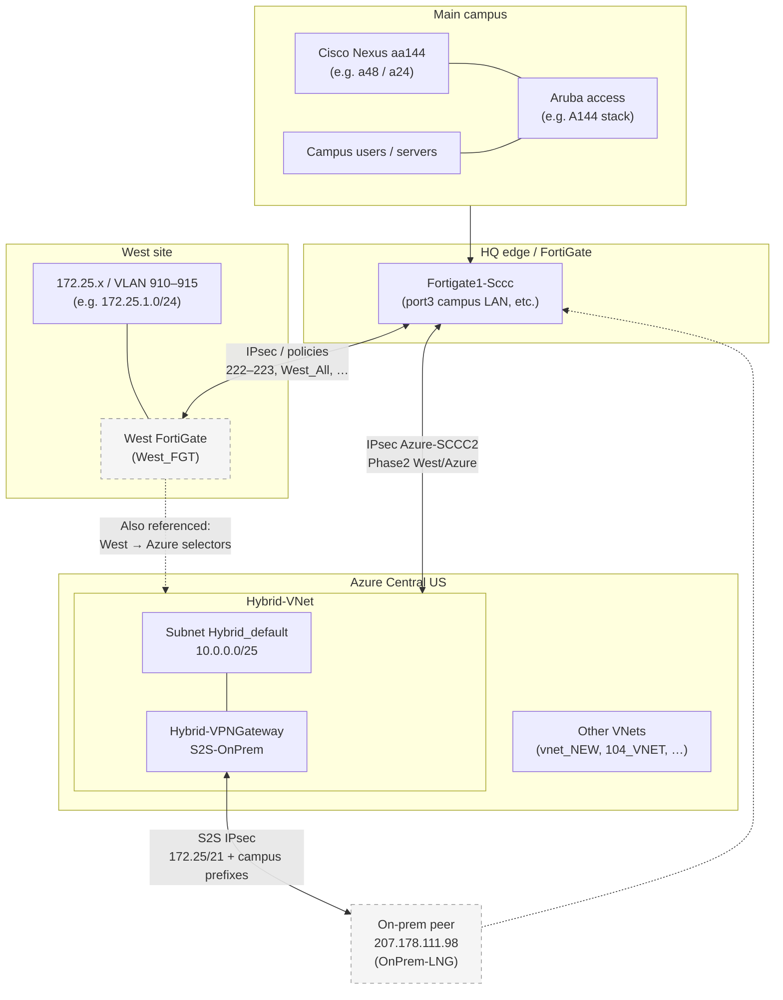

# SCCC network — consolidated notes (as provided)

**Scope.** This document assembles **only** what was inferred from configs and CLI output shared in the West / VLAN 910 / Azure review. It is **not** a full as-built survey. Anything not listed here was **not** verified.

**Navigation:** **`INDEX.md`** — master map of repo docs for **analysis**, **diagramming**, and **strategic planning** (includes Azure JSON export bundle usage).

**All buildings / master index:** For a single overview that lists **every campus building, athletics, remote site, and cloud** with network context, see **`SCCC_NETWORK_OVERVIEW_ALL_BUILDINGS.md`**. **On-prem port/OSPF detail:** **`BUILDING_SWITCH_TOPOLOGY.md`**.

**Last assembled:** from FortiGate exports, Nexus/Aruba snippets, Azure CLI (`RG-Prod-CentralUS`, `Hybrid-VNet`, `OnPrem-LNG`, etc.), and VLAN naming on **sw-aa144-a48** / **sw-aa144-a24**.

---

## 1. Sites and roles

| Site / element | Role (as discussed) |
|----------------|---------------------|
| **Main campus** | Primary LAN; Nexus **aa144** distribution; Aruba access (e.g. **A144** stack); routing toward HQ and services. |
| **Epworth** | Connected via **dark fiber** / **OSPF** style design; **VLAN 773** present on Nexus; contrasted with West. |
| **West** | **Non-overlapping 172.25.x** space; **VLAN 910** = **172.25.1.0/24**; traffic **not** extended as campus L2 like Epworth; reaches main/Azure via **IPsec** through **FortiGate** (West_FGT / HQ policies). |
| **HQ FortiGate** | **Fortigate1-Sccc**; central policy and **IPsec** to West and to **Azure** (`Azure-SCCC2`, etc.). |
| **Azure (production)** | **Central US**; **Hybrid-VNet** with **Hybrid-VPNGateway** and **S2S** to on-premises **Local Network Gateway**; workload subnet **Hybrid_default** **10.0.0.0/25**. |

---

## 2. Addressing summary (known)

| Range / object | Notes |
|----------------|--------|
| **172.25.0.0/21** | West aggregate referenced in FortiGate Phase 2 (**Vlan_910_915**), static routing discussion, and **Azure OnPrem-LNG** prefix list. |
| **172.25.0.0/24** | **West_Wired** (FortiGate); also listed on **OnPrem-LNG**. |
| **172.25.1.0/24** | **Vlan_910**; in **West_17225_to_Azure** Phase 2; **not** in **West_All** group as discussed. |
| **172.25.2.0/24 … 172.25.6.0/24** | Listed on **OnPrem-LNG** individually; **172.25.0.0/21** also present. |
| **10.11.16.0/24** | **West_Wireless** (FortiGate **West_All**). |
| **10.0.0.0/25** | FortiGate **InternalAzure**; Azure **Hybrid_default** subnet on **Hybrid-VNet**. |
| **10.70.0.0/16** | In **RT-To-Onprem** UDR → **VirtualNetworkGateway**; many **10.70.x** subnets also on **OnPrem-LNG**. |
| **192.168.0.0/16** | **RT-To-Onprem** UDR → **VirtualNetworkGateway**; **OnPrem-LNG** includes **192.168.0.0/16**. |
| **10.40.x, 10.30.x, 172.20.x, …** | Numerous entries on **OnPrem-LNG** (campus/server ranges); full list is in Azure CLI output (not duplicated here). |

---

## 3. FortiGate (Fortigate1-Sccc) — known items

### 3.1 Address / policy themes

- **West_All:** **West_Wired** (172.25.0.0/24) + **West_Wireless** (10.11.16.0/24); analysis noted **Vlan_910 (172.25.1.0/24)** is **not** included.
- **InternalAzure:** **10.0.0.0/25** (aligns with Azure **Hybrid_default**).
- Policies discussed: **222/223** (West ↔ campus), **229** (campus → Azure), **244/245/246/248** (West ↔ Azure); **West_to_Azure**, **West_Azure_Allow** use **srcaddr West_All** + **dstaddr InternalAzure** where applicable.
- **SCCC_To_WestsideFGT:** **port3 → West_FGT**; sources **WestFGT_Outgoing**, destinations **WestFGT_Incoming**.
- **WestFGT_To_SCCC:** **West_FGT → port3**; sources **WestFGT_Incoming**, destinations **WestFGT_Outgoing** (on-prem destinations explicitly listed in policy objects).

### 3.2 Routing (as cited)

- Static route **172.25.0.0/21 → West_FGT** (or equivalent next-hop) was part of the discussion for reaching West from HQ context.

### 3.3 IPsec (runtime notes shared)

- **West_FGT:** ~**28** Phase 2 selectors, **14** up; **~240k TX errors** flagged for investigation (MTU/path).
- **Azure-SCCC2:** **56** selectors, **33** up (not all SAs up at once is normal).
- Phase 2 names referenced: **West_17225_to_Azure** (172.25.1.0/24 → Azure prefix), **Vlan_910_915** (172.25.0.0/21 → Azure).

---

## 4. Microsoft Azure (RG-Prod-CentralUS — CLI-confirmed)

### 4.1 Hybrid-VNet

- **Name:** `Hybrid-VNet`
- **Region:** `centralus`
- **Address prefixes:** **10.0.0.0/24**, **10.3.0.0/27**
- **Subnets observed:**
  - **GatewaySubnet:** **10.0.0.224/27** — **Hybrid-VPNGateway** (active/active, **VpnGw2AZ**)
  - **Hybrid_default:** **10.0.0.0/25** — workload NICs, **NAT Gateway** `Hybrid-NatGW01`, UDR **RT-To-Onprem**, private endpoints (e.g. Grafana PE), etc.
- **DNS servers (VNet):** **10.40.1.80**, **10.40.1.82**, **10.0.0.34**, **10.40.1.77**, **10.40.1.68** (on-prem / hybrid DNS mix).
- **Peering:** none listed in the `show` output shared (`virtualNetworkPeerings`: empty).

### 4.2 VPN gateway and connections

- **Hybrid-VPNGateway:** **RouteBased**, **Generation2**, **activeActive** true, **enablePrivateIpAddress** true; public tunnel endpoints (e.g. **48.214.x.x**) in JSON; **NAT rule** **OnPrem-SNAT**: internal **10.1.0.0/24** → external **172.20.1.0/26** (EgressSnat).
- **S2S-OnPrem:** **Connected**; gateway **Hybrid-VPNGateway**; local gateway **OnPrem-LNG**; **egressNatRules** reference **OnPrem-SNAT**.
- **Azure_Ipsec:** **NotConnected**; gateway **VNG_NEW** (different VNet **vnet_NEW**); separate from Hybrid path.

### 4.3 Route tables

- **RT-To-Onprem** (associated with **Hybrid_default**): **192.168.0.0/16** → **VirtualNetworkGateway**; **10.70.0.0/16** → **VirtualNetworkGateway**; **10.0.0.192/26** → **VnetLocal** (bastion carve-out).
- **RT_RG_CUS:** **10.40.1.0/24** → **VirtualNetworkGateway**; associated with **vnet_NEW** / **Subnet-App**.

### 4.4 Local Network Gateway (OnPrem-LNG)

- **Gateway IP:** **207.178.111.98** (from `local-gateway list` table).
- **Address prefixes:** includes **172.25.0.0/21**, **172.25.0.0/24**–**172.25.6.0/24**, plus extensive **10.x**, **172.16/18/20/23**, **192.168.0.0/16**, and others (full list from CLI — confirm in portal if editing).

### 4.5 Other VNets in subscription (names only)

From `az network vnet list`: **Hybrid-TEST01-vnet**, **104_VNET**, **vnet-prod-web**, **vnet_NEW**, **aadds-vnet** (SCCC_DOMAIN_SERVICES), **test-gateway-vnet**, **TestVM01-vnet**, **test-wsus-vnet**, etc.

---

## 5. Cisco Nexus (aa144) — from repo configs

**Distribution switches referenced:** **sw-aa144-a48**, **sw-aa144-a24** (hostname `sw-aa144-A24`). Both carry a large shared VLAN database; **VLAN 773** is named **EpworthBuilding** (dark-fiber / OSPF context); **VLAN 616** is named **OSPF10-Epworth** (interconnect naming also appears in interface descriptions, e.g. **OSPF10-Epworth-To-Cisco9k-A48**). **VLAN 910** does **not** appear as a campus-extended West VLAN in these files (consistent with VPN-only West). Default routing and core next hops should be confirmed on live devices.

**Campus map (main SCCC campus):** Authoritative **building letter** labels and map notes (Hobble = **A** + **AA**, IT in Hobble; Student Union = **SU**, **SA**, **SW**; **Calvin Allied Health (CAH)** / Allied Health; **COS** = Cosmetology; **SLC**; **Epworth** / **West** remote and not on the main map) are maintained in **`BUILDING_LIST.md`** alongside the VLAN-derived inventory below.

### 5.1 Buildings and sites (from VLAN `name` fields)

The following are **identifiers taken from VLAN names** on the aa144 pair. They reflect **naming convention** (rooms, letters, or functional areas), not necessarily a complete facilities list. **VOIP-***, **PSEC-***, **DAC-*** prefixes are typically **per-building or per-zone** voice/security segments; **OSPF10-*** names identify **routing interconnections** to remote sites or stacks.

#### Letter / zone codes (voice and security groupings)

| Pattern | Meaning (as labeled) |
|--------|----------------------|
| **A**, **AA** | Building **A** and **Annex / AA** areas (paired with room numbers below). |
| **S**, **H**, **B**, **M**, **C**, **E**, **EA**, **T**, **TA**, **TB**, **TD**, **TT** | Building zones used in **VOIP-** and **PSEC-** / **DAC-** names. |
| **COS** | **Cos** / Cosmetology (**CosmoBuilding**, **COS109**). |
| **V** | **V** building (**ArubaAP-V**). |
| **SLC** | **Student Life Center** area (**SLC_students**, **SLC-Buildings**, **SLC-*** Aruba SSIDs, **VOIP-SLC**, **PSEC-SLC**, etc.). |
| **CAH** | **CAH** complex (**CAH-General**, **CAH-Labs**, **CAH-Sim-Record**, **VOIP-CAH**). |

#### Named buildings, wings, and rooms (deduplicated)

| Building / site name (from configs) | Notes |
|------------------------------------|--------|
| **A001**, **A103**, **A136**, **A149**, **A166**, **A166A** (a48), **A192** | **A**-building numbered VLANs. |
| **A144-Staff**, **OSPF10-A144-1**, **OSPF10-A144-2** | **A144** distribution / stack context. |
| **AA101**, **AA105** (+ **AA105-Staff**), **AA109**, **AA112**, **AA113**, **AA131**, **AA137** (a24), **AA155**, **AA159**, **AA163** | **Annex AA** rooms. |
| **B101** | **OSPF10-B101**. |
| **TA107** | **OSPF10-TA107** (Workforce / **TA-** area). |
| **TA-WorkForceCenter** | Workforce center. |
| **SU121**, **SU108-Bookstore** | **Student Union** (room **121**, **108** bookstore). |
| **COS109** / **CosmoBuilding** | Cosmetology; VLAN name **OSFP-COS109** on **a48** vs **OSPF10-COS109** on **a24** (same site — naming differs). |
| **V103-AgLab**, **AgBuilding** | Agriculture lab / building. |
| **EpworthBuilding**, **E117-E213-EpworthLabs**, **Vlan773**, **OSPF10-Epworth** | **Epworth** site (fiber); **616** OSPF naming. |
| **ColvinBuilding** | Present on **a24** VLAN names. |
| **HumanitiesBuilding**, **H109-HumLab**, **OSPF10-Humanities** (a48) | Humanities. |
| **HealthCenter**, **OSPF10-HealthCenter** | Health center. |
| **TechSchoolLabs**, **TechLectureCapture**, **TechHVAC**, **OSPF10-TechSchool** | Technical school cluster. |
| **MaintenanceBuilding**, **HVAC-Maintenance**, **HVAC-maintenance**, **SWKTS-Data** | Maintenance / HVAC / ticketing. |
| **Fire-Alarm-System** | Fire alarm infrastructure VLAN. |
| **Gym-Pressbox**, **Gym-Video** (a24) | Athletics / gym. |
| **SA-building** | **SA** building. |
| **SLC-Buildings**, **StudentBuilding**, **SLC_*** WLAN | Student Life Center buildings and wireless. |
| **SharpCC** / **SmartCCWired** | **Sharp** / **Smart** campus center wiring (a48 **SmartCCWired**; a24 **SCCWiredNetwork**). |
| **Stor2**, **Stor413** | Storage areas. |
| **DR-site-equipment** | Disaster-recovery / DR site equipment. |
| **P2P-AA109-AA144** (a48) | Point-to-point label between **AA109** and **A144**. |
| **test-vlan** | Test VLAN (should not be used for production documentation). |

#### OSPF / core link names (not buildings, but geographic anchors)

| Name | Role (inferred from label) |
|------|----------------------------|
| **OSPF100-A144Core-A48** (a48) | Core integration on **A144** / **a48**. |
| **OSPF2**, **OSPF10-AA144-A48**, **OSPF10-T48-A48** | Inter-switch or inter-stack OSPF. |
| **OSPF10-T48-A48** | Link involving **T48** and **A48**. |
| **OSPF10-SLC151** (a48) / **OSPF-SLC151-Aruba** (a24) | **SLC151** path (naming differs slightly between files). |
| **OSPF10-V201** (a24) | **V201** interconnect. |
| **OSPF10-B101**, **OSPF10-TA107**, **OSPF10-AA105**, **OSPF10-SU121**, **OSPF10-SharpCC** | Building-scoped OSPF anchors. |
| **OSPF10-HealthCenter** | Health center OSPF segment. |

**a48 vs a24:** Inventories are largely aligned; differences spotted in names include **A166A**, **AA137**, **OSPF10-Humanities**, **OSPF100-A144Core-A48**, **P2P-AA109-AA144**, **WLAN-APs-WCS**, **TestingAndGI**, **MM-Equipment-in-E**, **ColvinBuilding**, **ArubaAP-H**, **OSPF10-V201**, **SCCWiredNetwork** vs **SmartCCWired**, **Gym-Video**, **VMotionLive** vs **VMotion** naming — reconcile against **show vlan** on live devices if a single master list is required.

---

## 6. Aruba (A144 stack) — from repo configs

- Access-layer **SVIs** in the **700s** range (e.g. **701–731**) in captured sections; **772–775** not in the excerpt (may exist on other stacks, e.g. **sw-t122** in searches).
- **OSPF** toward Cisco on **VLAN 622** (per prior discussion).
- **No local 172.25.x / VLAN 910** expected for VPN-only West unless L2 stretch is added by design.

---

## 7. Issues and design notes (summary)

| Area | Note |
|------|------|
| **FortiGate** | **West_All** may exclude **172.25.1.0/24**; policies using **West_All** toward **InternalAzure** may miss **Vlan_910** sources. |
| **FortiGate** | Print/SaaS may need destinations outside **10.0.0.0/25**; separate objects/policies may apply. |
| **FortiGate** | **West_FGT** tunnel TX errors and Phase 2 “up” count warrant follow-up. |
| **Azure** | **OnPrem-LNG** includes **172.25.0.0/21** — no LNG omission identified for West in CLI output. |
| **Azure** | **Azure_Ipsec** (VNG_NEW) **NotConnected** — track separately from Hybrid production path. |
| **Campus L2** | **VLAN 910** not modeled like **773** on aa144; typically intentional for West over VPN. |

---

## 8. Diagram (logical)

See Mermaid source below. **Dashed lines** indicate relationships that are **inferred** or **multi-path** (FortiGate↔Azure vs Azure VPN GW↔on-prem) and should be validated against your official diagrams.

**Diagram notes**

- **LNGIP** is the address configured on **OnPrem-LNG**; it may terminate on the same FortiGate cluster or another edge device — **confirm on your WAN drawing**.
- Traffic from **Azure VMs** to **172.25.x** uses **routes** derived from **OnPrem-LNG** prefixes (and UDRs); traffic from **West** to **10.0.0.0/25** may use **FortiGate IPsec** depending on routing and policy — **two different architectural legs** are common; validate with a traceroute from each side.

---

## 9. Suggested next artifacts (if you want a fuller library)

- Export FortiGate **full** `show` (sanitized) into this repo with a date stamp.
- One **official** WAN diagram (PDF/Visio) cross-referenced to §8.
- Azure **effective routes** screenshot from a **Hybrid_default** VM NIC for the ticket archive.
