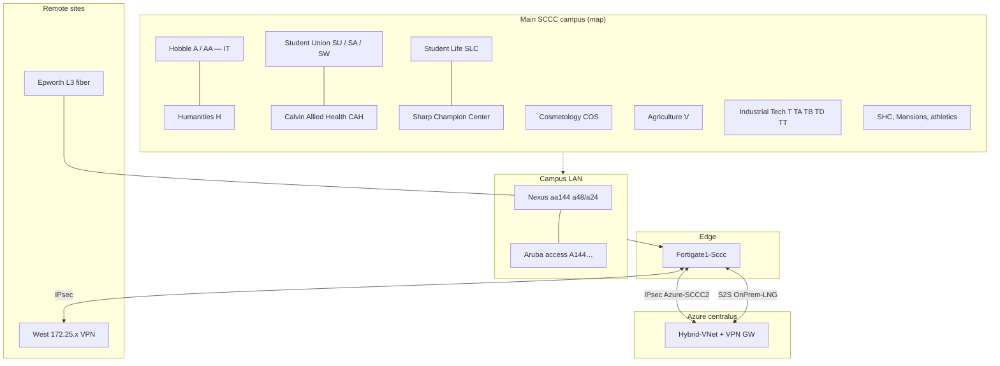

# SCCC network overview — all buildings and sites

**Organization:** Seward County Community College (SCCC).  
**Purpose:** One document for **physical locations** (map + remote) and **how they relate** to the documented network (FortiGate, Azure, Cisco aa144, Aruba).

**Sources:** Campus map (isometric main campus), stakeholder notes in **`BUILDING_LIST.md`**, switch configs **sw-aa144-a48** / **sw-aa144-a24**, FortiGate/Azure analysis, **`NETWORK_OVERVIEW.md`**.

**Limitations:** Not a certified as-built. VLAN names may lag renamed facilities (e.g. **ColvinBuilding** vs **Calvin Allied Health**). Confirm critical rows with facilities + live `show vlan`.

---

## 1. Master list — all buildings and sites

### 1.1 Main campus (physical buildings on official map)

These are the **named facilities** on the main campus map (Circle Drive, Cottonwood Ln., etc.). **Letter codes** match map labels where shown.

| # | Facility (official / map) | Code(s) | Network role (high level) |
|---|---------------------------|---------|---------------------------|
| 1 | **Hobble Academic Building** | **A**, **AA** | Primary academic block; **IT** is in Hobble. User VLANs **A###** / **AA###**; VOIP **VOIP-A**, **VOIP-AA**; distribution **A144** stack uplinks. |
| 2 | **Humanities Building** | **H** | **HumanitiesBuilding**, **H109-HumLab**, **OSPF10-Humanities**; **VOIP-H**. |
| 3 | **Student Union** (connected complex) | **SU**, **SA**, **SW** | **SA-building**, **SU121**, **SU108-Bookstore**, student WLAN patterns; **VOIP-S** (where used for union zone). |
| 4 | **Calvin Allied Health** (Allied Health) | **CAH** | **CAH-General**, **CAH-Labs**, **CAH-Sim-Record**, **VOIP-CAH**. |
| 5 | **Cosmetology** | **COS** | **CosmoBuilding**, **COS109**, **ArubaAP-COS**, **VOIP-COS**. |
| 6 | **Student Life Center** | **SLC** | **SLC-Buildings**, **StudentBuilding**, **SLC_*** SSIDs, **VOIP-SLC**, **PSEC-SLC**; near **SHC** / **Mansions** on map. |
| 7 | **Agriculture** | **V** | **AgBuilding**, **V103-AgLab**, **ArubaAP-V**, **VOIP-V**. |
| 8 | **Industrial Technology Campus** | **T**, **TA**, **TB**, **TD**, **TT** | **TechSchoolLabs**, **TechLectureCapture**, **TechHVAC**, **OSPF10-TechSchool**, **TA-WorkForceCenter**, **TA107**, **VOIP-T***, etc. |
| 9 | **Sharp Family Champion Center** | (events / athletics) | **SharpCC**, **SmartCCWired** / **SCCWiredNetwork** — align to **SFCC** on map. |
| 10 | **SHC** | — | On map; tie VLANs only if named in future configs. |
| 11 | **Mansions** | — | Residential cluster on map; same as above. |

### 1.2 Main campus — athletics and outdoor (map)

| Facility | Notes |
|----------|--------|
| **French Family Field** (softball) | East side of campus. |
| **Brent Gould Field** (baseball) | Southeast of main loop. |
| **Tennis** | South of baseball. |
| **Gym-Pressbox**, **Gym-Video** (configs) | Likely athletics / press; confirm vs Sharp vs field houses. |

### 1.3 Main campus — operations, storage, safety (config names; may span buildings)

| Name (config) | Typical purpose |
|----------------|-----------------|
| **MaintenanceBuilding** | Physical plant |
| **HVAC-Maintenance**, **HVAC-maintenance**, **SWKTS-Data** | HVAC / work orders |
| **Fire-Alarm-System** | Life safety |
| **Stor2**, **Stor413** | Storage |
| **DR-site-equipment** | Disaster recovery gear (location per DR plan) |
| **HealthCenter**, **OSPF10-HealthCenter** | Validate vs **CAH** or separate clinic |

### 1.4 Remote sites (not on main campus map)

| Site | Addressing / network | Connectivity |
|------|----------------------|--------------|
| **Epworth** | **VLAN 773** `EpworthBuilding`; **616** **OSPF10-Epworth**; **E117-E213-EpworthLabs** | Dark fiber / OSPF to core; **not** L2 same as main campus user VLANs. |
| **West** | **172.25.0.0/21** (e.g. **VLAN 910** = **172.25.1.0/24**); **West_Wired** / **West_Wireless** on FortiGate | **IPsec** via **West_FGT** and **Fortigate1-Sccc**; **not** extended as campus VLAN 910 on aa144. |

### 1.5 Cloud and logical “sites”

| Logical site | Role |
|--------------|------|
| **Microsoft Azure** (e.g. **Hybrid-VNet**, **centralus**) | **Hybrid_default** **10.0.0.0/25**; **Hybrid-VPNGateway** **S2S-OnPrem** to **OnPrem-LNG**; aligns with FortiGate **InternalAzure** **10.0.0.0/25** for policy. |
| **HQ FortiGate** (**Fortigate1-Sccc**) | Policy hub: main campus **port3**, **West_FGT**, **Azure-SCCC2** IPsec. |

### 1.6 Master spreadsheet — recommended columns (data vs voice vs OSPF)

**We do not have a complete subnet row for every building in this repo.** VLAN **names** exist on aa144; **L3 gateways** for many user VLANs are often on **Aruba access** stacks or elsewhere. For a defensible master list, **separate**:

| Column | What it represents | Typical source |
|--------|-------------------|----------------|
| **Building / zone** | Official map or facilities name | Map + **`BUILDING_LIST.md`** |
| **Data (user/LAN) VLAN ID** | PCs, printers, most AP bridged SSIDs | `show vlan` on access + dist |
| **Data subnet + gateway** | e.g. `10.40.x.0/24` → `.1` | **`show ip int brief`** on device that owns the SVI (often Aruba) |
| **Voice VLAN ID** | e.g. **VOIP-H**, **VOIP-AA** (may differ per port) | Phone config / Aruba AP wired profile |
| **Voice subnet + gateway** | May be **shared** across several buildings | Nexus sample: **Vlan301–303** below; DHCP scope in IPAM |
| **OSPF / routed “transit” VLAN** | **Vlan611–628** style **/30** to another router — **not** the user LAN | Nexus **`sw-aa144-a48`** SVIs |
| **Distribution / access switch** | Hostname | Configs + labels |
| **Mgmt / loopback** | **192.168.2.x** on **Vlan1**, OOB, etc. | Per device |

**Voice VLAN** vs **data VLAN** vs **OSPF VLAN** should **not** be merged into one column; **OSPF /30** addresses are **link networks**, not “the building’s subnet.”

---

## 2. Addressing, VLAN roles, and switch inventory (partial — `sw-aa144-a48`)

This section is **runtime/config evidence** from **`sw-aa144-a48.sccc.edu`** only. It does **not** replace a full IPAM export.

### 2.1 Voice — SVIs on Nexus (sample aggregation, not all buildings)

| VLAN | Description (config) | Gateway on Nexus | Other |
|------|----------------------|------------------|--------|
| **301** | VOIP in A144 | **10.30.1.1/24** | DHCP relay **10.40.1.40**, **10.40.1.70**; PIM sparse |
| **302** | VOIP in AA105 & AA144 | **10.30.2.1/24** | Same relay |
| **303** | VOIP in SU121 & SA208 | **10.30.3.1/24** | Same relay |

Other **VOIP-*** VLANs (**304–322**, …) appear in the **VLAN name list** but **no `ip address`** on this Nexus in the captured sections — likely **L2 toward access** or **gateway on another device**. Extend the table after **`show ip int brief`** on **Aruba** stacks (e.g. **sw-A144-1-aruba**, **swa-aa148**, **swa-h128**).

### 2.2 OSPF / routed point-to-point SVIs (transport — **not** user LANs)

These are **172.20.2.x/30** (and one **172.20.3.x/30**) links on **`sw-aa144-a48`**, OSPF process **10** or **100** as shown in config.

| VLAN | Description | Local address |
|------|-------------|---------------|
| **611** | OSPF-TO-6509-CORESWITCH | **172.20.2.1/30** |
| **612** | OSPF-TO-9300NEXUS-BuilingT | **172.20.3.1/30** |
| **613** | OSPF-H128-CiscoA48 | **172.20.2.5/30** |
| **614** | OSPF10-AA144-A48Cisco9k | **172.20.2.9/30** |
| **615** | OSPF10-A48Cisco9k-TO-T48Cisco9k | **172.20.2.13/30** |
| **616** | OSPF10-Epworth-To-Cisco9k-A48 | **172.20.2.17/30** |
| **617** | OSFP10-TechSchool-To-A48Cisco9k | **172.20.2.21/30** |
| **618** | OSFP10-SLC151-Dorms-To-A48Cisco9k | **172.20.2.25/30** |
| **619** | OSPF10-V201 | **172.20.2.29/30** |
| **620** | OSPF10-B101 | **172.20.2.33/30** |
| **621** | OSPF10-TA107 | **172.20.2.37/30** |
| **622** | OSPF10-A144-1 | **172.20.2.41/30** |
| **623** | OSPF10-A144-2 | **172.20.2.45/30** |
| **624** | OSPF10-SharpCC | **172.20.2.49/30** |
| **625** | OSPF10-AA105 | **172.20.2.53/30** |
| **626** | OSPF-SU121 | **172.20.2.57/30** |
| **627** | OSPF-COS109 | **172.20.2.61/30** |
| **628** | OSPF-Healthcenter | **172.20.2.65/30** |

### 2.3 Other L3 on same switch (evidence)

| VLAN | Role | Address |
|------|------|---------|
| **1** | In-band / management context | **192.168.2.70/16** (see live mask in production) |
| **2** | SAN00 | **172.16.13.1/26** |
| **3** | — | **172.16.13.65/28** |
| **17** | Heartbeat (VPC / peer) | **172.20.11.1/30** (pair with **a24** `.2`) |

### 2.4 Building-relevant downlinks (interface **description** — `sw-aa144-a48`)

| Neighbor / link (from description) | Notes |
|------------------------------------|--------|
| **SW-AA144Core-USD480** | Core uplink |
| **SW-H128-TEST**, **SW-H128-PRIM** | **H128** site |
| **SW-CAH144** | **CAH** access stack |
| **AA148** Aruba 6100 uplink | Building **AA148** |
| **A144** Aruba switch stack **1** / **2** | Main Hobble access |
| **SharpCC to AA144** | Sharp Champion Center path |
| **AA109-PaloAlto-Link** | Security appliance |
| **FortiGate1** / **FortiGate2** Port35 IDEATEK | Edge / Internet |
| **Aruba-7205-Controller-1** / **-2** | WLAN controllers |
| **Link … AA144 A48 and T122 T48** | **T122** / **T48** topology |

Use this as a seed for a **building ↔ access switch** matrix; add **mgmt IP** per switch from `show run` or DCIM.

**Live inventory (your list):** **`SWITCH_INVENTORY.md`** contains the **building / status / IP** table, with **likely `*.sccc.edu` file** matches and action items for gaps (**Missing Live**, **Missing Inventory Label**).

**Building-facing downlinks + OSPF (aggregated):** **`BUILDING_SWITCH_TOPOLOGY.md`** ties **Nexus port descriptions** (**sw-aa144-a48** / **a24**), **OSPF /30 SVIs**, **inventory IPs**, and **config filenames** in one place.

### 2.5 `sw-aa144-a24` (pair)

- **Hostname:** `sw-aa144-A24`  
- **Vlan1:** **192.168.2.71/16** (peer to **a48** `.70`)  
- Fewer **SVI** lines in the saved config than **a48**; treat **a48** as the richer L3 reference for OSPF/voice in this export.

### 2.6 What else to include (documentation checklist)

| Artifact | Why |
|----------|-----|
| **Per-building row** with **Data VLAN**, **Voice VLAN**, **OSPF transit** (if any), **subnets**, **DHCP scope ID** | Single pane for helpdesk + engineering |
| **Switch inventory**: hostname, **mgmt IP**, **building**, **model**, **serial**, **upstream port** | Lifecycle + troubleshooting |
| **Aruba**: Mobility Conductor / **7205** — AP groups ↔ **building** | Wireless mapping |
| **FortiGate**: zone + interface ↔ **10.x** campus aggregate | Policy clarity |
| **IPAM** (Infoblox, NetBox, spreadsheet): authoritative **subnet** | Replaces guesswork |
| **UPS / OOB** (iDRAC, BMC) | Out-of-band access |
| **WAN / DIA** circuit IDs per FortiGate port | Not in L2 switch configs |

---

## 3. Room and wing codes (inside Hobble and elsewhere)

**Hobble** contains both **A** and **AA** zones. Representative **VLAN names** from aa144:

- **A:** A001, A103, A136, A149, A166, A166A (a48), A192  
- **AA:** AA101, AA105, AA109, AA112, AA113, AA131, AA137 (a24), AA155, AA159, AA163  
- **Other anchors:** B101, TA107, SU121, SU108-Bookstore, COS109  

Full detail: **`BUILDING_LIST.md`** and **`NETWORK_OVERVIEW.md` §5.1**.

---

## 4. Network architecture (summary)

### 4.1 Sites and roles

| Element | Role |
|---------|------|
| **Main campus LAN** | Cisco Nexus **aa144** (**a48** / **a24**); Aruba access (e.g. **A144**); users and printers in building VLANs above. |
| **Epworth** | Routed extension; **773** / OSPF naming. |
| **West** | VPN-centric; **FortiGate** policies **West_All**, **WestFGT_***, IPsec **West_FGT** / **Azure** Phase 2. |
| **Azure** | **S2S-OnPrem** **Connected**; **OnPrem-LNG** includes **172.25.0.0/21** and main campus ranges. |

### 4.2 Addressing (abbreviated)

| Range / object | Notes |
|----------------|--------|
| **172.25.0.0/21** | West aggregate (FortiGate Phase 2, Azure LNG, routing). |
| **10.0.0.0/25** | **InternalAzure** ↔ **Hybrid_default**. |
| **10.70.0.0/16**, **192.168.0.0/16** | Azure UDR toward **VirtualNetworkGateway**; broad on-prem in **OnPrem-LNG**. |

### 4.3 FortiGate, Azure, switching (pointer)

Detailed policy lists, IPsec counts, Azure gateway JSON, and **full VLAN name table** are in **`NETWORK_OVERVIEW.md`** §§3–6. **Do not duplicate** large tables here; this file is the **building-centric** index.

---

## 5. Diagram — locations + network paths

High-level: **main campus buildings** share **aa144 → FortiGate LAN**; **Epworth** and **West** are **off-map** paths; **Azure** is cloud.

**Not shown:** Every room VLAN, **Azure_Ipsec** (VNG_NEW) path, or exact WAN IP for **207.178.111.98** — see **`NETWORK_OVERVIEW.md` §8**.

---

## 6. Known issues (summary)

| Area | Note |
|------|------|
| **FortiGate** | **West_All** may omit **172.25.1.0/24**; Azure-bound policies may need **srcaddr** fix. |
| **FortiGate** | **West_FGT** tunnel TX errors / Phase 2 inventory. |
| **Naming** | **ColvinBuilding** VLAN vs **Calvin Allied Health** signage — reconcile. |
| **Azure** | **Azure_Ipsec** not connected — separate from Hybrid production. |

Full table: **`NETWORK_OVERVIEW.md` §7**.

---

## 7. Related files in this repo

| File | Contents |
|------|----------|
| **`SWITCH_INVENTORY.md`** | **Live switch list:** building/device, status, mgmt/SVI IP, links to `*.sccc.edu` configs. |
| **`BUILDING_SWITCH_TOPOLOGY.md`** | **Downlinks + OSPF:** a48/a24 **Ethernet** ↔ building, **Vlan611–628**, hostname ↔ **IP** ↔ **config file**. |
| **`BUILDING_LIST.md`** | Map ↔ letter codes ↔ config names (detail). |
| **`NETWORK_OVERVIEW.md`** | Full technical notes, VLAN tables, Mermaid WAN diagram. |
| **`Main_West_NETWORK_OVERVIEW.md`** | Copy aligned with main overview (keep in sync if editing). |

---

## 8. Suggested next steps

- Keep **one** of **`NETWORK_OVERVIEW.md`** vs **`Main_West_NETWORK_OVERVIEW.md`** as canonical to avoid drift.  
- Add a **PDF campus map** under `docs/` and link it here.  
- Build a **spreadsheet** from **§1.6** (columns): start with **§2.2–2.3** on **`sw-aa144-a48`**, then add **data/voice subnets** from **`show ip interface brief`** on each **Aruba** stack listed in **§2.4** (and **`show ip dhcp database`** / IPAM if used).  
- Optional: CSV export of **§1.1** for facilities if non-technical staff need edits.
