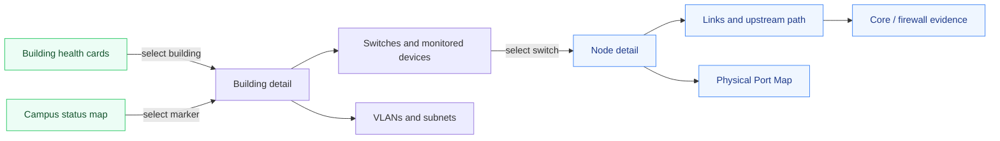

# Building-first network support flow

The default support journey begins with the affected place rather than requiring
staff to know a hostname, VLAN, or port before they start. Existing topology and
port evidence remain available at progressively deeper levels.

## Interaction rule

Building cards and campus-map markers use a normal single selection. This keeps
the flow usable with a mouse, keyboard, touch display, and assistive technology.
The Port Map is preserved without simplification because its port-level evidence
is valuable during engineering work.
