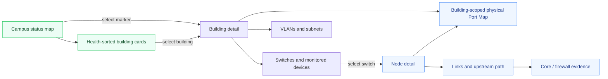

# Building-first network support flow

The default support journey begins with the affected place rather than requiring
staff to know a hostname, VLAN, or port before they start. Existing topology and
port evidence remain available at progressively deeper levels.

## Interaction rule

Building cards and campus-map markers use a normal single selection. This keeps
the flow usable with a mouse, keyboard, touch display, and assistive technology.
The Port Map is preserved without simplification because its port-level evidence
is valuable during engineering work.

## Shared campus-map layout

Buildings and Monitoring render the same `CampusStatusMap` component and read
the same persisted `/api/network/buildings/map-layout` records. Layout reads are
served with `Cache-Control: no-store`; each open view refreshes on focus, tab
visibility, a save/reset notification, and a 30-second safety interval. Editing
remains in Buildings, while Monitoring is a live consumer of that canonical
saved layout. Monitoring also derives its **Campus Map Green** count and overall
status from that same loaded layout, so a hidden marker is not counted as an
active map exception. Mark and Tracy, as CIO users, open **Edit Map** on the Buildings
page to move markers and use the **Building visibility** controls. **Save Map**
persists both position and visibility; other roles can read the map but cannot
change this operational view.

The write contract accepts both the short built-in marker codes and URL-encoded
`CUSTOM:<building name>` identifiers up to 200 characters, so newly
administered buildings can be positioned, hidden, and restored without losing
their stable identity. Visibility uses metadata rows in the existing
`network_layout_positions` table, avoiding a production schema dependency. The
reader also translates legacy `building-hidden:<building name>` rows. Resetting
the layout removes saved positions and visibility metadata, so every default
marker becomes visible again. Visibility omitted by an older cached editor is
treated as "leave the current setting alone"; only an explicit `true` or
`false` changes a marker's visibility.

`Mansions` is a default visible marker (`MAN`). Its observed switch pair is
`SWA-SLAB` (`192.168.2.176`) and `SWA-SLCDE` (`192.168.2.177`); these assignments
remain separate from Student Living Center. See
[shared-campus-map-flow.mmd](shared-campus-map-flow.mmd).
