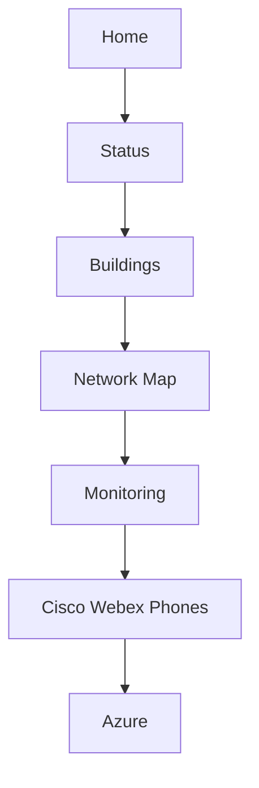
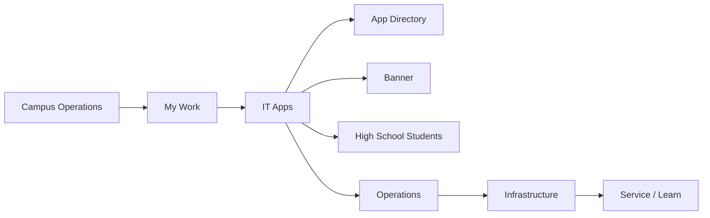

# Campus Operations navigation

The persistent app switcher leads to Home (`/`), Status & Reporting
(`/status`), IT Tools & Network (`/network`), and Troubleshooting
(`/support`). The role-aware sidebar remains the detailed navigation layer.

The sequence supports a consistent operational investigation: establish overall
state, identify the affected building, inspect its physical network, validate
live telemetry, check voice/E911 service, and then follow cloud dependencies.

The sidebar then moves from operational awareness into personal work and the
applications staff use to act on that work. IT Apps is intentionally adjacent to
My Work rather than buried beneath infrastructure records.

