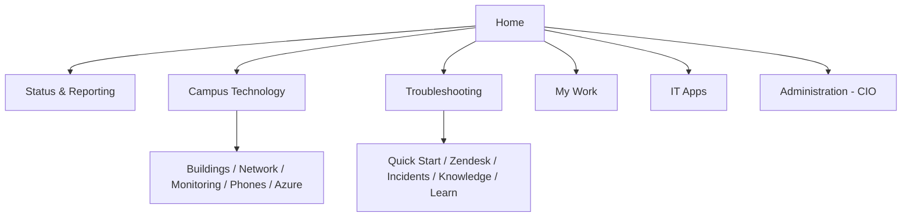
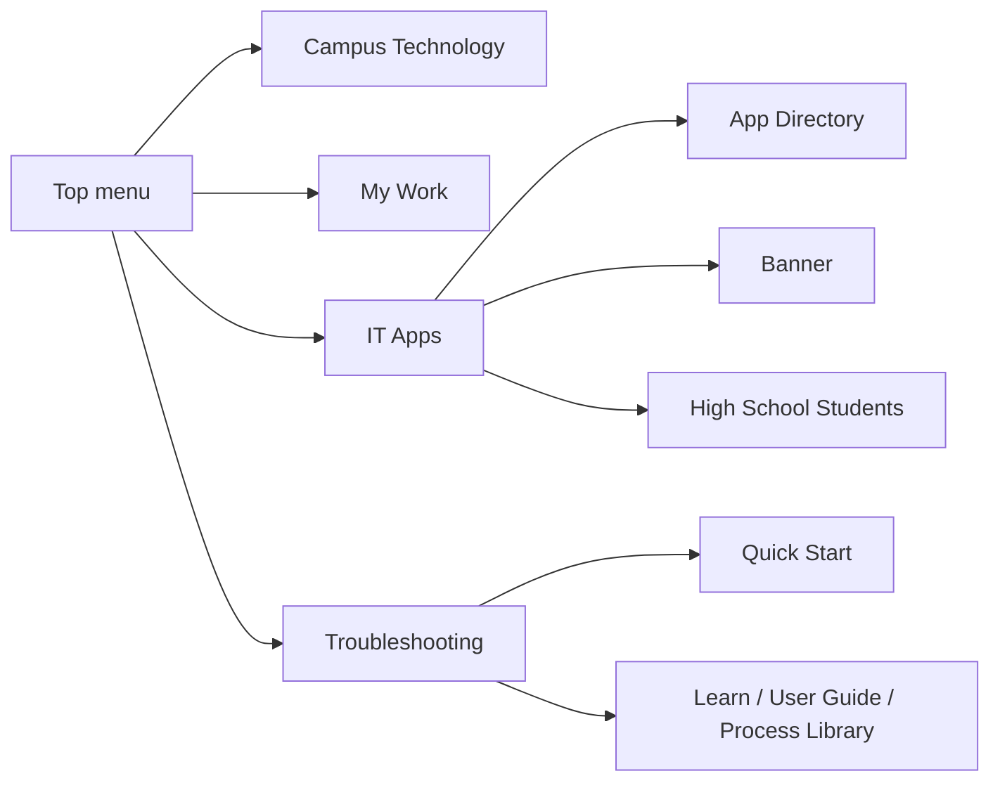

# Campus Operations navigation

The persistent top menu leads to Home (`/`), Status & Reporting (`/status`),
Campus Technology (`/network/buildings`), Troubleshooting (`/support`), My Work
(`/todos`), IT Apps (`/it-apps`), and CIO-only Administration (`/projects`).
Each category title opens its landing page; its separate chevron opens the
role-aware destination list.

The sequence supports a consistent operational investigation: establish overall
state, identify the affected building, inspect its physical network, validate
live telemetry, check voice/E911 service, and then follow cloud dependencies.

The top menu keeps personal work and operational applications adjacent without
mixing them into the infrastructure destinations. IT Apps remains next to My
Work rather than being buried below network records.

