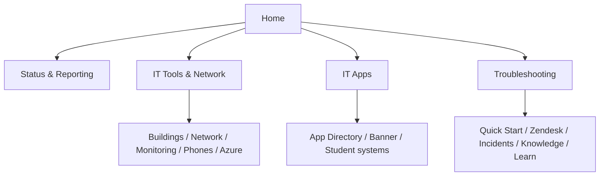
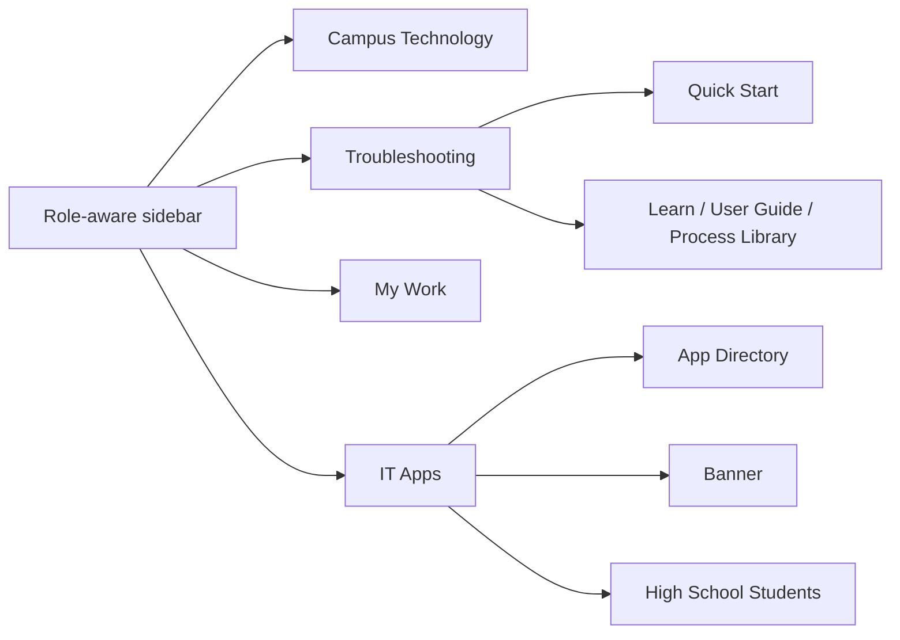

# Campus Operations navigation

The Home command center presents four first-class workspaces: Status &
Reporting (`/status`), IT Tools & Network (`/network`), IT Apps
(`/it-apps`), and Troubleshooting (`/support`). On inner pages, Apps remains
visible in the four-position workspace switcher from every mode. The role-aware
sidebar remains the detailed navigation layer.

The sequence supports a consistent operational investigation: establish overall
state, identify the affected building, inspect its physical network, validate
live telemetry, check voice/E911 service, and then follow cloud dependencies.

The sidebar moves from operational awareness into personal work and the
applications staff use to act on that work. IT Apps is intentionally adjacent
to My Work rather than buried below network records.

