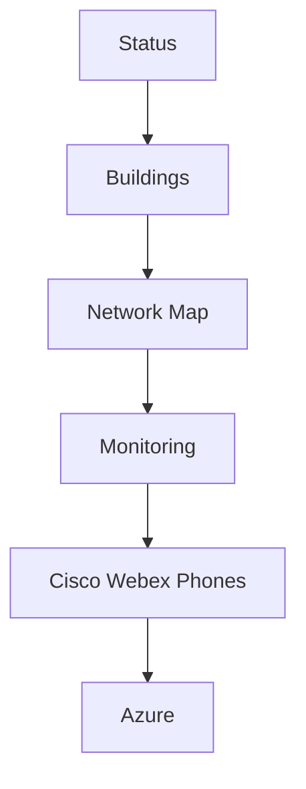

# Campus Operations navigation

The sidebar leads with the systems staff use to understand and narrow an active
campus issue. `Status` is the shared IT Home at `/`.

The sequence supports a consistent operational investigation: establish overall
state, identify the affected building, inspect its physical network, validate
live telemetry, check voice/E911 service, and then follow cloud dependencies.
