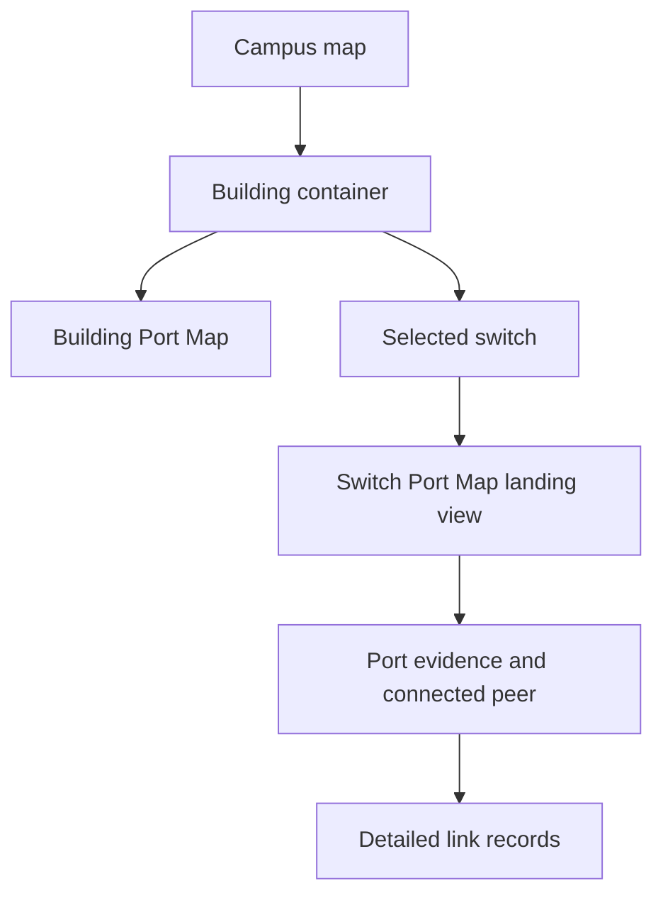
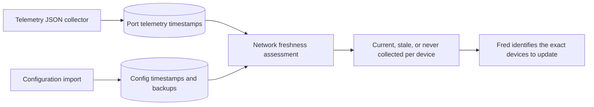

# Network drill-down and evidence freshness

The network experience follows the way technicians narrow an incident:

Visualizer building containers are sized from their current children. Saved
positions remain useful, but historical container dimensions are ignored so a
new switch or VLAN cannot render outside its building boundary.

Fred receives freshness metadata whenever she queries the Network Map overview:

- Telemetry becomes stale after 36 hours because the expected collection is
  nightly.
- Configuration evidence becomes stale after 90 days and should also be
  refreshed immediately after an approved configuration change.
- Missing evidence is reported as `never_collected` or `not_imported`; it is
  never interpreted as a healthy or known-good device.
