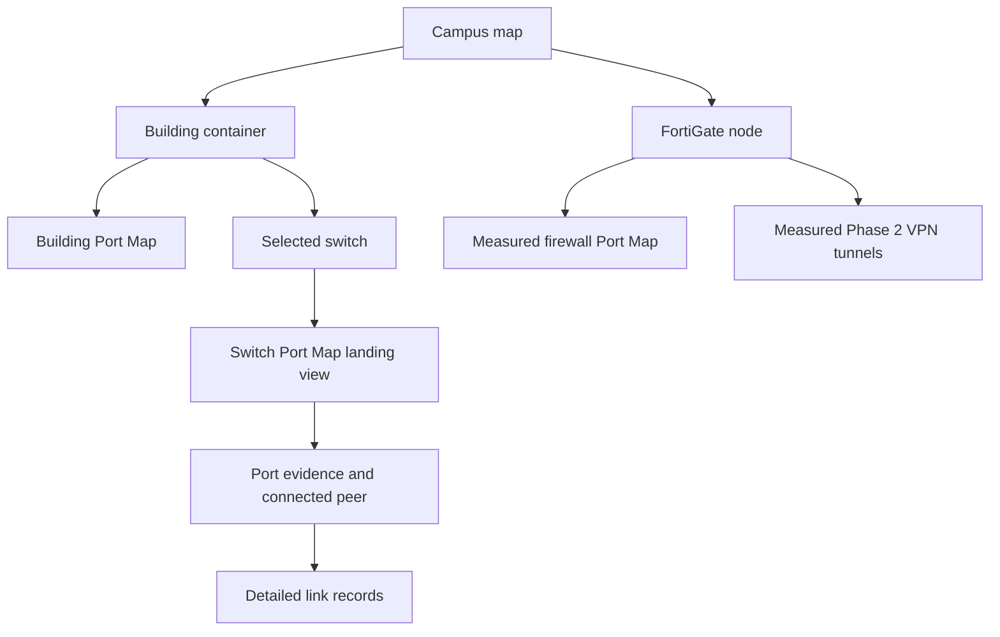
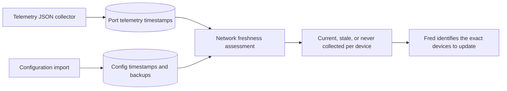
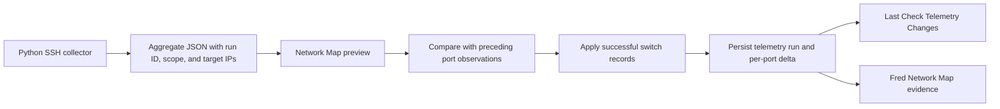

# Network drill-down and evidence freshness

The network experience follows the way technicians narrow an incident:

Visualizer building containers are sized from their current children. Saved
positions remain useful, but historical container dimensions are ignored so a
new switch or VLAN cannot render outside its building boundary.

Legacy Student Living labels such as `Student Life AB`, `Student Life DE`,
`SWA-SLAB`, and `SWA-SLCDE` resolve to the canonical **Student Living Center**
building. The original hostname and room/section remain on the device record;
canonicalization changes grouping only.

Fred receives freshness metadata whenever she queries the Network Map overview:

- Telemetry becomes stale after 36 hours because the expected collection is
  nightly.
- Configuration evidence becomes stale after 90 days and should also be
  refreshed immediately after an approved configuration change.
- Missing evidence is reported as `never_collected` or `not_imported`; it is
  never interpreted as a healthy or known-good device.

## Per-metric evidence coverage

Port timestamps describe the overall observation, not proof that every metric
was available. Error and discard counters, utilization, and optics/DOM values
are independently observation-only:

- A returned numeric zero is retained as an observed zero.
- A missing or unsupported OID is stored and reported as `null` (rendered as a
  blank/em dash), never converted to zero.
- Utilization requires two valid octet observations, a valid elapsed interval,
  and a positive port speed observed in the current poll. A stored speed from
  an older poll may remain visible as inventory context, but it is not reused
  to manufacture a fresh utilization value. Otherwise utilization remains blank.
- The current NOC SNMP profile does not collect optics/DOM. Link-up state,
  transceiver media type, speed, and a fresh port timestamp cannot substitute
  for received/transmit power, temperature, or optical alarm evidence.
- A normalized SSH telemetry import explicitly clears older counter,
  utilization, and DOM values because that import schema does not collect
  them. This prevents stale measurements from masquerading as current.

Fred receives nulls plus this evidence policy and must say “not collected” or
“unavailable” rather than infer a healthy value.

FortiGate detail pages merge the NOC Telegraf/Influx rows with persisted port
inventory by interface name. Current measured fields win; unmatched saved
interfaces remain visible but their live-only values stay blank. Only IF-MIB
`ifType=6` rows become physical ports. The separate tunnel view reads the
dedicated Phase 2 measurement and shows its observation time; an absent
measurement is labeled unknown rather than treated as zero tunnels.

## Telemetry run history and delta

Every telemetry file declares its collection scope and exact target IPs. A
targeted run is `partial`; an inventory-wide run is `full`. Files created by
older collectors without an explicit scope are treated as `partial` because
scope must never be guessed from the number of records.

Import is strictly target-scoped. Only switches present in the file may have
their telemetry updated. A switch omitted from either a partial or full run is
not changed, marked stale/down/bad, retired, or deleted. Failed or omitted
targets remain inventory records, and retirement/deletion always requires a
separate explicit authorized action. Fred may report a device's independently
calculated evidence age, but must not describe it as a consequence of a scoped
upload.

For a switch with no preceding stored physical-port telemetry, the import is an
initial baseline. Its ports are stored, but they are not reported as newly
added or changed. Delta reporting begins with the next collection.

The JSON import previews every physical interface against its preceding stored
telemetry observation. Applying the import records the collector `run_id`,
timestamps, failed targets, aggregate counts, affected devices, and individual
operational, administrative, native-VLAN, description, newly observed, and
missing-port changes.

An observed up/down delta is historical evidence, not an outage declaration.
Fred must cross-check Monitoring or an approved live probe when a user asks
whether a service or port is currently operational.
