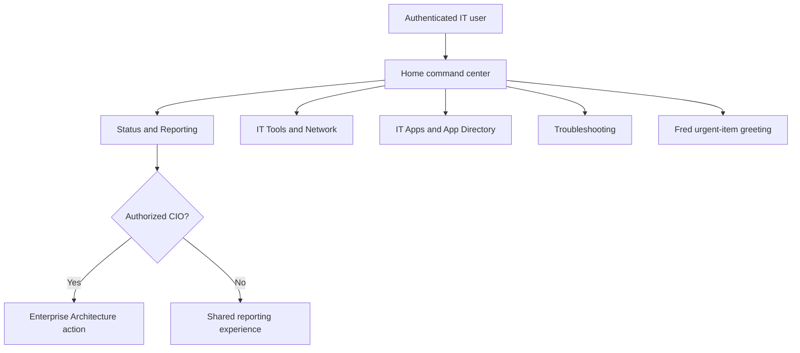

# Shared IT Home

All authenticated IT staff use the same `/` command center. It presents the
four first-class workspaces without changing their established authorization,
data, or operational behavior. Apps is a peer of Status, Network, and
Troubleshooting—not a utility hidden below them.

Live summary hooks drive the Home cards and Status dashboard. IT Apps reuses
the existing directory, internal routes, and approved external links.
Troubleshooting uses the existing Zendesk activity endpoint and established
tool routes. The inner-page workspace switcher keeps Apps directly reachable
in every mode.
