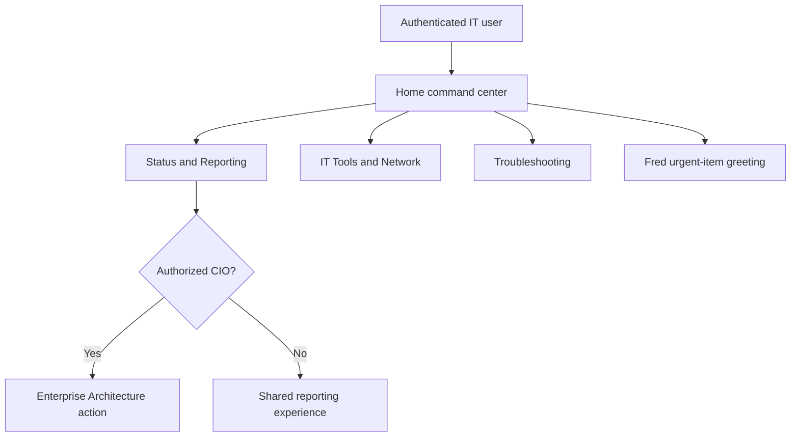

# Shared IT Home

All authenticated IT staff use the same `/` command center. It presents the
three primary app contexts without changing their established authorization,
data, or operational behavior.

Live summary hooks drive the Home cards and Status dashboard. Troubleshooting
uses the existing Zendesk activity endpoint and established tool routes.
