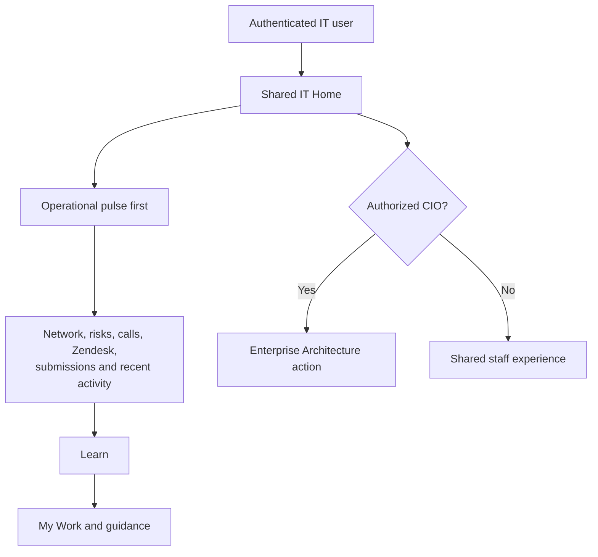

# Shared IT Home

All authenticated IT staff use the same `/` homepage and operational context.
Role checks govern privileged actions rather than selecting a different page.

This keeps the information architecture consistent for Mark and the rest of the
team while preserving authorization boundaries for CIO-only capabilities.
