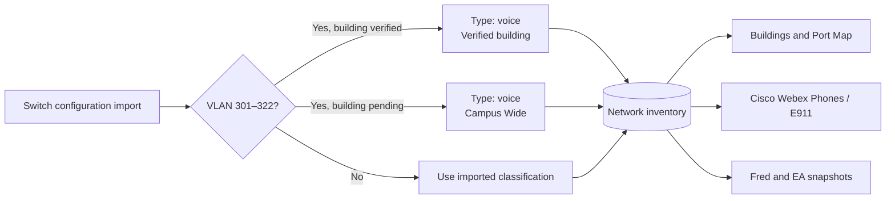

# SCCC voice and E911 VLAN authority

The CIO confirmed that VLANs 301 through 322 are the SCCC voice/E911 range.
They must be classified as `voice` throughout Network Inventory, Buildings,
Cisco Webex Phones, Fred, and architecture snapshots.

| VLAN | Building ownership |
|---:|---|
| 301–302 | Hobble |
| 303 | Student Union / Student Activities |
| 304 | Humanities |
| 305 | Cosmetology |
| 306 | Agriculture |
| 307–309 | Student Living Center |
| 310 | Tech Building B |
| 311 | Maintenance Building |
| 312–315 | Campus Wide — awaiting verified physical mapping |
| 316 | Tech Building T |
| 317 | Tech Building A |
| 318 | Tech Building B |
| 319 | Tech Building D |
| 320 | Tech Building T |
| 321 | Student Living Center |
| 322 | Allied Health |

Names, descriptions, subnets, gateways, and maintenance history are preserved.
Future configuration imports apply this governed classification so a switch
configuration cannot silently put these VLANs back into `user` or attach an
unverified VLAN to a physical building.

